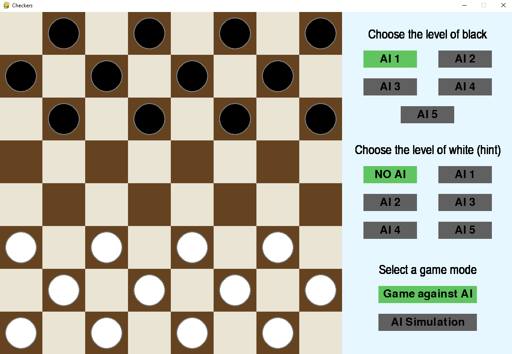
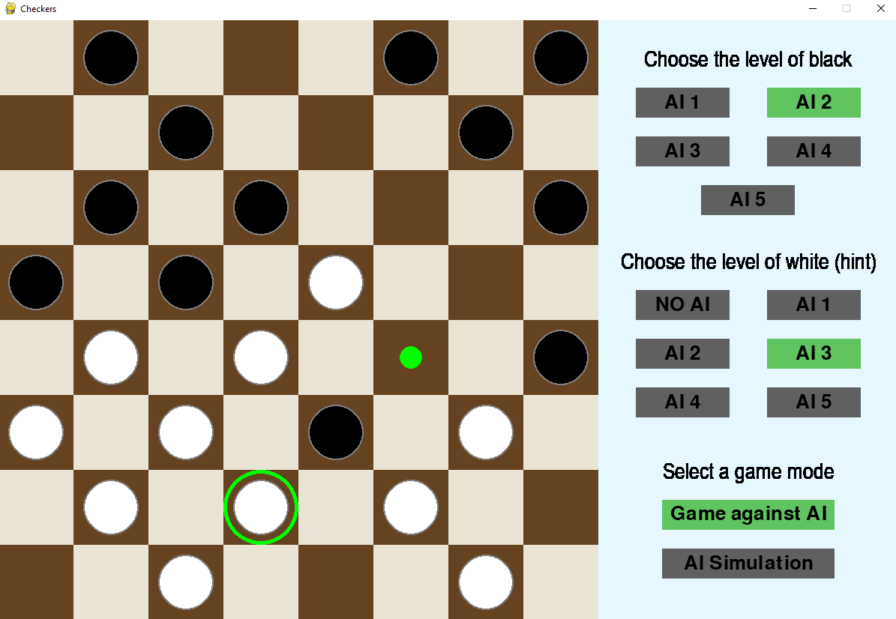
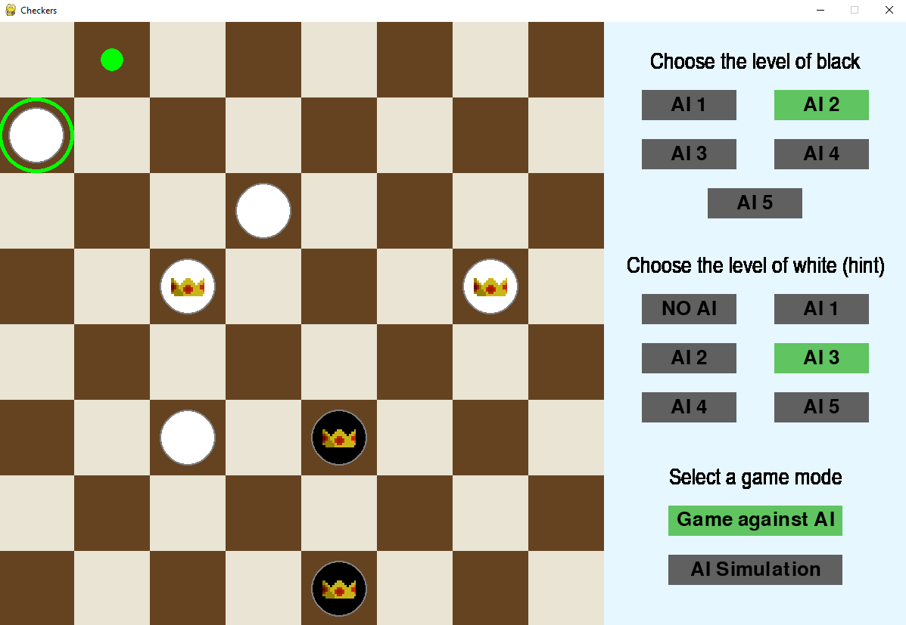

<h1>
Checkers with MinMax assist
</h1>

Checkers application written in the PyGame library, which uses AI algorithms to support the player's decisions.
Before starting the game, the player selects the level of the opponent and the level of the algorithm suggesting which move to make.
The programme uses a custom implementation of the MinMax algorithm, augmented with weights for individual chessboard fields and figures. 
The levels represent the depth of next moves that are searched to find the best solution.

The program is also able to simulate the game between two algorithms in order to check the effectiveness of the selected solutions.

## Start board

## Game hint 1

## Game hint 2

